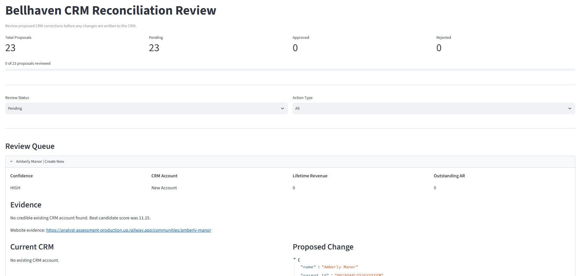
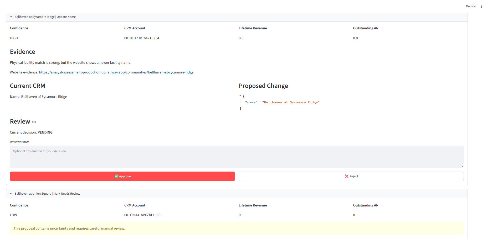
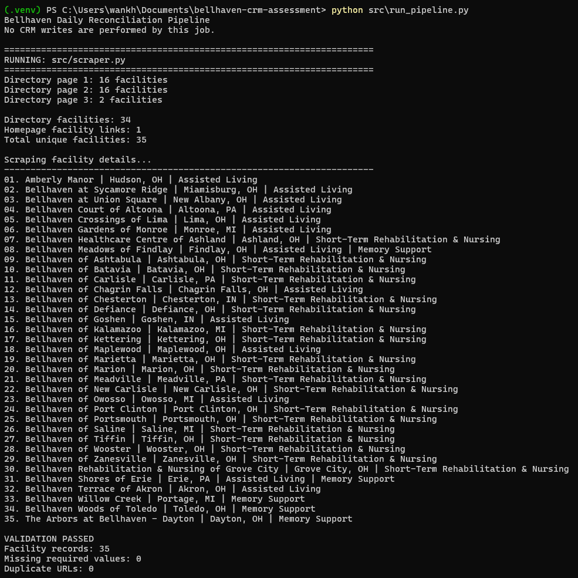
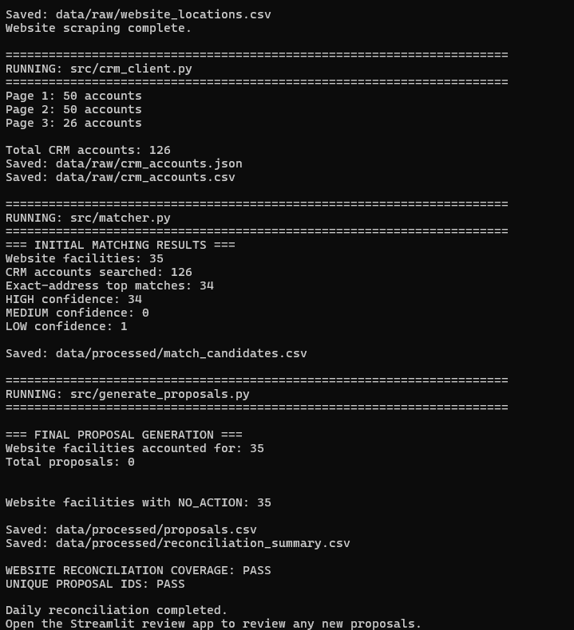

# Bellhaven CRM Reconciliation

## Overview

This project compares Bellhaven Senior Living's current website locations with accounts in the CRM sandbox.

The goal is to identify CRM problems such as:

- Missing facilities
- Wrong parent companies
- Outdated facility names
- Incorrect addresses or ZIP codes
- Duplicate accounts
- Bellhaven accounts that are no longer on the website
- Change of ownership cases that require special CHOW handling

All proposed changes are reviewed by a person before anything is written to the CRM.

---

## Project Flow

```text
Bellhaven Website
       ↓
Scrape Current Facilities
       ↓
35 Website Locations
       ↓
    Compare
       ↓
126 CRM Accounts
       ↓
Matching + Business Rules
       ↓
Proposed Changes
       ↓
Streamlit Review App
       ↓
Approve / Reject
       ↓
Approved Changes Only
       ↓
    CRM API
       ↓
  Corrected CRM
```

## Project Flow:


## Main Components

The project is divided into small components so each part of the reconciliation process is easy to understand, test, and maintain.

### **1. Website Scraper**
**File:** `src/scraper.py`

Scrapes the current Bellhaven facility information from the website.

It collects:

- **Facility name**
- **Street address**
- **City**
- **State**
- **ZIP code**
- **Care offerings**
- **Source URL**

The scraper checks both the community directory and the homepage so that all current Bellhaven locations are captured.

**Output:** `data/raw/website_locations.csv`

---

### **2. CRM API Client**
**File:** `src/crm_client.py`

Connects to the CRM sandbox using the provided API token and downloads all CRM accounts.

It handles API pagination automatically and saves the CRM data locally for comparison.

**Outputs:**

- `data/raw/crm_accounts.csv`
- `data/raw/crm_accounts.json`

---

### **3. Matching Engine**
**File:** `src/matcher.py`

Matches each Bellhaven website facility with the most likely CRM account.

The matching logic uses:

- **Street address**
- **ZIP code**
- **City**
- **State**
- **Facility name similarity**

Address information receives the highest weight because facility names may change after acquisitions or rebranding.

The script also normalizes common address variations such as:

- *Road* → *Rd*
- *Street* → *St*
- *West* → *W*
- *Northwest* → *NW*
- *Avenue* → *Ave*

**RapidFuzz** is used to compare facility names.

The top three CRM candidates are retained as supporting evidence for uncertain matches.

**Output:** `data/processed/match_candidates.csv`

---

### **4. Proposal Generator**
**File:** `src/generate_proposals.py`

Analyzes the matching results and determines whether a CRM change is needed.

Possible actions include:

- `CREATE_NEW`
- `UPDATE_NAME`
- `UPDATE_ADDRESS`
- `UPDATE_ZIP`
- `REPARENT`
- `UPDATE_NAME_AND_REPARENT`
- `CHOW_REQUIRED`
- `MARK_DUPLICATE_INACTIVE`
- `INACTIVATE_STALE`
- `MARK_NEEDS_REVIEW`

The script also performs a reverse check to identify Bellhaven CRM accounts that are no longer represented on the current website.

**Outputs:**

- `data/processed/proposals.csv`
- `data/processed/reconciliation_summary.csv`

---

### **5. Human Review App**
**File:** `app.py`

A local **Streamlit** application used to review proposed CRM changes before they are applied.

For each proposal, the reviewer can see:

- **Current CRM values**
- **Proposed values**
- **Supporting evidence**
- **Match confidence**
- **Lifetime revenue**
- **Outstanding AR**

The reviewer can then:

- **Approve**
- **Reject**
- Add an optional **review note**

*No CRM change is written automatically.*

Review decisions are stored in:

`data/review_decisions.db`

This allows previous decisions to remain available after the application is restarted.

---

### **6. CRM Writer**
**File:** `src/crm_writer.py`

Writes only **human-approved proposals** back to the CRM sandbox.

It supports:

- **POST** for creating new CRM accounts
- **PATCH** for updating existing CRM accounts
- Special **CHOW** processing using both POST and PATCH

The writer records completed actions so the same approved proposal is not applied twice.

It also supports a dry-run mode:

```bash
python src/crm_writer.py --dry-run
```

### **7. Daily Reconciliation Pipeline**
**File:** `src/run_pipeline.py`

Runs the complete daily **read-only reconciliation process**.

The pipeline performs the following steps:

1. Scrapes the current Bellhaven website locations.
2. Downloads the latest CRM accounts.
3. Runs the matching logic.
4. Generates new proposals only when a change is needed.

#### **Daily Flow**

```text
Scrape Website
      ↓
Download CRM Accounts
      ↓
Run Matching
      ↓
Generate Proposals
```


### Run the pipeline manually with:
```bash
python src/run_pipeline.py
```

The daily pipeline does not write any changes to the CRM.

Any new proposal must first be reviewed and approved through the Streamlit review app. Only approved proposals can later be applied using crm_writer.py.

This keeps the automated daily process safe while maintaining human approval before any CRM update.

----------------------------------------------------------------------------------------------------------------------------------------------------------

## How to Run the Project from PowerShell

The following steps show how to run the project from a new PowerShell window.

### **1. Open PowerShell and go to the project folder**

```powershell
cd C:\...\bellhaven-crm-assessment
```

---

### **2. Activate the virtual environment**

```powershell
.\.venv\Scripts\Activate.ps1
```

After activation, the terminal should show:

```text
(.venv) PS C:\...\bellhaven-crm-assessment>
```

---

### **3. Set the CRM API token**

The CRM token is stored as an environment variable and is not hardcoded in the project.

```powershell
$env:CRM_API_TOKEN="YOUR_API_TOKEN"
```

Replace `YOUR_API_TOKEN` with the API token provided for the assessment.

To confirm that the token is set without displaying the actual token:

```powershell
if ($env:CRM_API_TOKEN) { "CRM token is set" } else { "CRM token is NOT set" }
```

Expected result:

```text
CRM token is set
```

---

### **4. Run the daily reconciliation pipeline**

```powershell
python src\run_pipeline.py
```

This runs the following process:

```text
Scrape Bellhaven Website
        ↓
Download Latest CRM Accounts
        ↓
Match Website and CRM Records
        ↓
Generate Proposed Changes
```

This step is read-only and does not write changes to the CRM.

If the CRM is already fully reconciled, the final output should show no new proposals.

Example:

```text
Website facilities accounted for: 35
Total proposals: 0
Website facilities with NO_ACTION: 35

WEBSITE RECONCILIATION COVERAGE: PASS
UNIQUE PROPOSAL IDS: PASS
```

---

### **5. Start the Streamlit review app**

```powershell
streamlit run app.py
```

The Streamlit application will open in the browser.

The reviewer can:

- Review each proposed CRM change
- Review the supporting evidence
- Approve a proposal
- Reject a proposal
- Add an optional reviewer note

No CRM update is made simply by opening or reviewing the application.

---

### **6. Stop the Streamlit app when review is complete**

Return to PowerShell and press:

```text
Ctrl + C
```

This stops the Streamlit server.

---

### **7. Preview approved CRM changes**

Before writing approved changes to the CRM, run the writer in dry-run mode:

```powershell
python src\crm_writer.py --dry-run
```

This shows what would be written to the CRM without making any changes.

Review the output before continuing.

---

### **8. Apply approved changes to the CRM**

After reviewing the dry-run output, run:

```powershell
python src\crm_writer.py
```

Only proposals that were approved through the review process are applied.

The writer uses:

- `POST` for new accounts
- `PATCH` for account updates
- `POST + PATCH` for CHOW cases

Previously applied proposals are recorded so they are not applied twice.

---

### **9. Refresh the CRM and verify the final result**

After approved changes are applied, run the reconciliation pipeline again:

```powershell
python src\run_pipeline.py
```

This refreshes the website and CRM data and checks whether any additional reconciliation work is required.

A fully reconciled result should show:

```text
Website facilities accounted for: 35
Total proposals: 0
Website facilities with NO_ACTION: 35
```

This confirms that the CRM is reconciled and that the pipeline can be safely rerun.

---

## Quick Run Reference

For normal use from a new PowerShell window:

```powershell
cd C:\...\bellhaven-crm-assessment

.\.venv\Scripts\Activate.ps1

$env:CRM_API_TOKEN="YOUR_API_TOKEN"

python src\run_pipeline.py

streamlit run app.py
```

After reviewing proposals:

```powershell
python src\crm_writer.py --dry-run

python src\crm_writer.py

python src\run_pipeline.py
```

### **Important**

- The API token must be set again when a new PowerShell session is opened.
- `run_pipeline.py` does not write to the CRM.
- CRM changes require reviewer approval.
- Always use `--dry-run` before applying approved CRM changes.
- Running the reconciliation pipeline again after write-back verifies that the CRM is in the expected final state.

### **Screenshots**

### Human Review App




### Daily Reconciliation Pipeline



